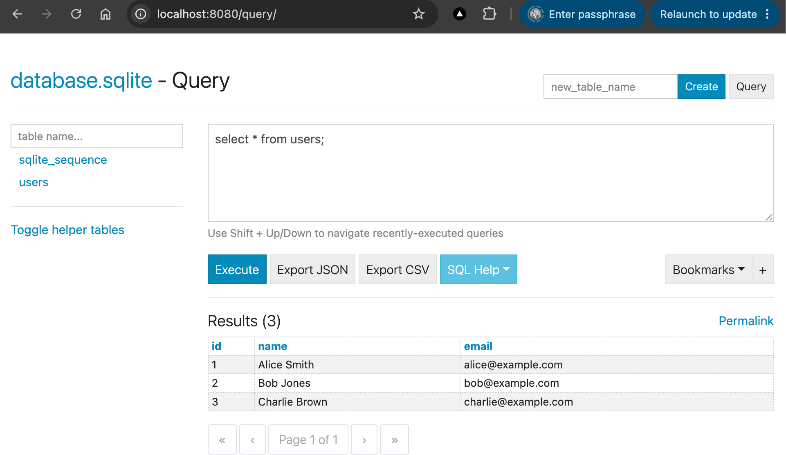

# 01. Sqlite-RawSQL

This sample project demonstrates how to query a SQLite database using Raw SQL from a Python backend (FastAPI).

## Screenshot(s)

## Learning Outcomes
* Understand how to connect to a SQLite database in Python.
* Execute Raw SQL queries (`SELECT`, `INSERT`) directly from the backend.
* View and interact with the SQLite database using a Web UI (`sqlite-web`).
