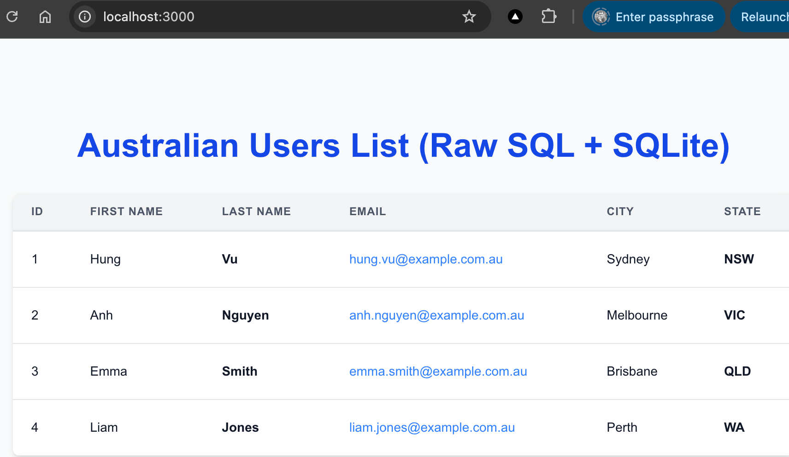

# 02. Sqlite-Nextjs-RawSQL

This sample project showcases how to integrate a SQLite database with a Next.js web application, executing RAW SQL queries without relying on an ORM.

## Screenshot 

## Learning Outcomes
* Connect to a SQLite database from Next.js Server Components.
* Write and execute RAW SQL queries to retrieve and manipulate data.
* Set up a complete local development environment using Docker, including a dedicated web UI (`sqlite-web`) for managing the SQLite database.
* Deploy a Next.js application that leverages raw SQL queries.
