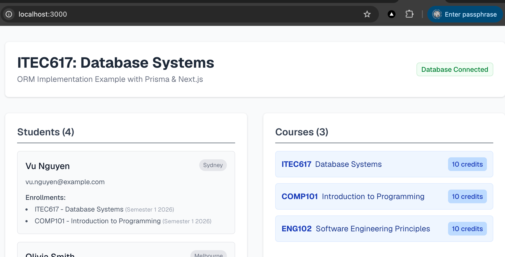

# 04. Postgres Prisma ORM

This sample project demonstrates how to connect a Next.js web application to a PostgreSQL database using **Prisma ORM**. It is tailored for Master of Computer Science students learning database concepts and how Object-Relational Mappers simplify interacting with relational databases.

## Screenshot(s)

## Learning Outcomes
- Understand the role of an ORM in modern web applications.
- Learn how to connect to a PostgreSQL database.
- Use Prisma Client to fetch data in a Next.js application.

## Structure
- `webapp/`: Next.js web application using Tailwind CSS and Prisma ORM.
- `docker-compose.yaml`: Configures the PostgreSQL database and pgAdmin Web UI.
- `init-scripts/`: Contains raw SQL to create and populate the database with mock Australian data when the container starts.

Screenshots and screencasts for this project can be found in the `images` directory.
