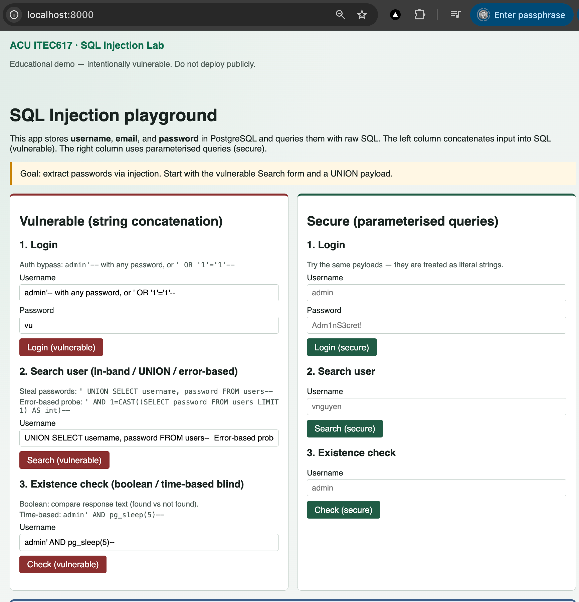

# 06.SQL-Injection

This sample project demonstrates **SQL injection (SQLi)** against a deliberately vulnerable
Python web application backed by **PostgreSQL**, using **raw SQL** (no ORM).

## Screenshot(s)

## Learning objectives

- Explain the three main SQLi categories: **in-band**, **inferential (blind)**, and **out-of-band**.
- Exploit a vulnerable login/search UI to **extract passwords** (UNION and error-based).
- Practise **boolean-based** and **time-based** blind techniques.
- Contrast vulnerable string concatenation with **parameterised queries**.
- Describe prevention strategies (binding, least privilege, libraries/wrappers, safe errors).

## Tech stack

| Layer         | Choice                           |
| ---------------| ----------------------------------|
| Database      | PostgreSQL 15                    |
| DB UI         | pgAdmin 4                        |
| Web app       | FastAPI + Jinja2 (Python 3.11)   |
| SQL access    | `psycopg` raw SQL                |
| Orchestration | Docker Compose                   |
| OOB helper    | Small HTTP listener on port 9999 |

## Project structure

- `app/` — Vulnerable and secure endpoints, templates, and tests
- `docs/` — SQLi types, root cause & prevention, exploitation walkthrough
- `init-scripts/` — Schema and Australian sample users (`username`, `email`, `password`)
- `listener/` — HTTP sink for out-of-band demos
- `images/` — Place screenshots and screencasts here

## Screenshots & screencasts

Visual aids can be added under the [images](images/) directory.

## Getting started

See [QUICKSTART.md](QUICKSTART.md) for run instructions and suggested payloads.

## Warning

This application is **intentionally insecure**. Run it only in a local Docker lab.
Do not expose the ports to the public internet.
