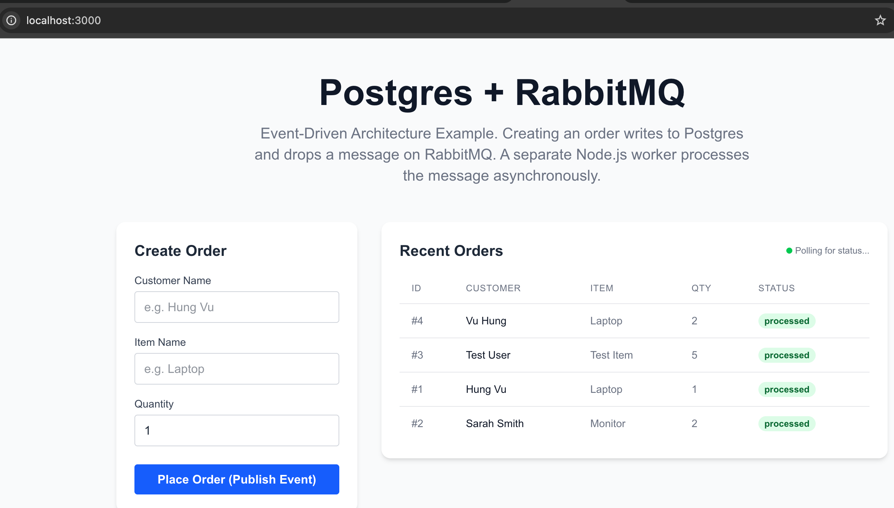
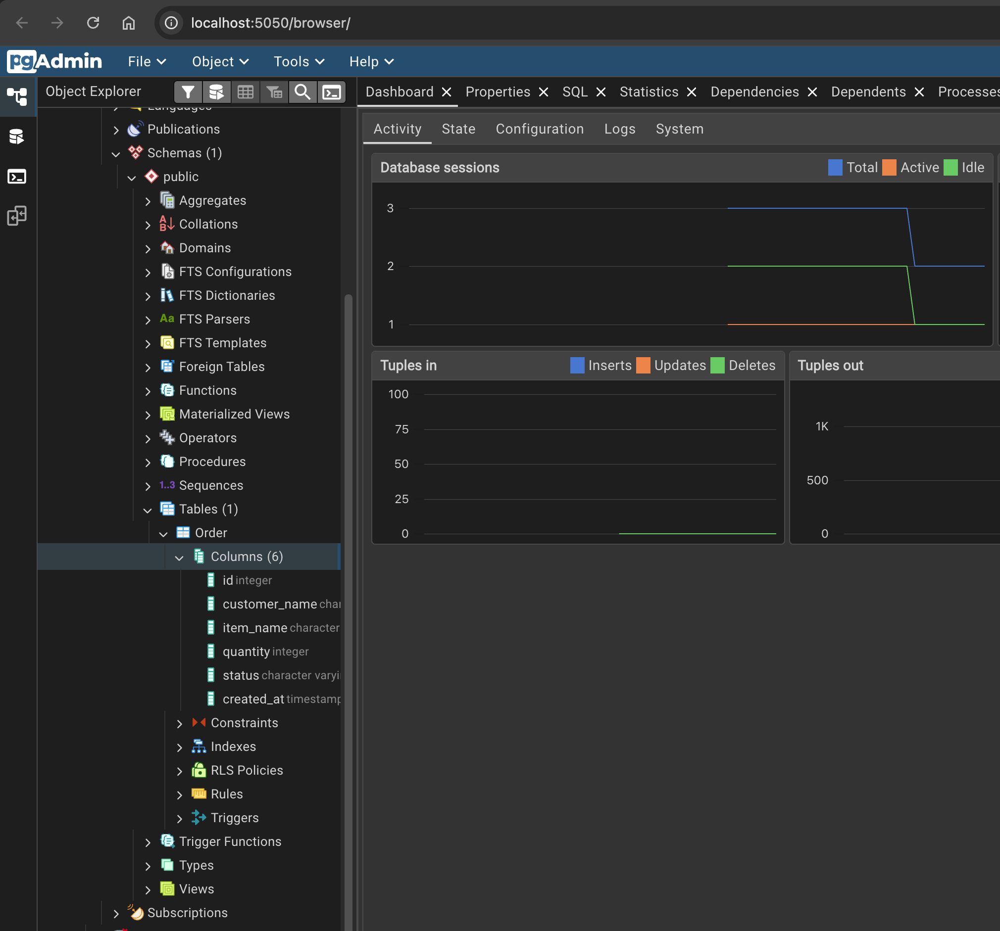
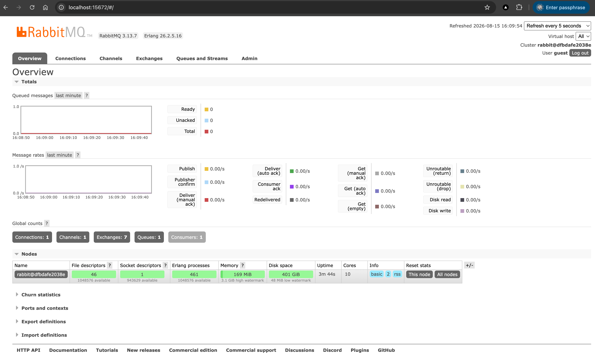

# 08.Postgres-RabbitMQ-Worker

This project introduces **Distributed Systems and Messaging** by implementing an Event-Driven Architecture.
It demonstrates how a Next.js frontend and API write to a PostgreSQL database (via Prisma) and subsequently publish an event (message) to a **RabbitMQ** queue. A separate, decoupled background **Node.js worker** consumes these messages asynchronously to process them (e.g., simulating a heavy report generation or email dispatch).

## Screenshot(s)

## Learning Objectives
- Understand the fundamentals of Event-Driven Architecture.
- Learn how to decouple services using Message Brokers like RabbitMQ.
- See how an API interacts with both a synchronous database (Postgres) and an asynchronous queue.
- Write a background worker process that consumes from a queue.
- Understand the benefits of async processing for scalability and responsiveness.

## Getting Started
Please refer to the [QUICKSTART.md](QUICKSTART.md) guide for step-by-step instructions on setting up the environment.

## Screenshots
Screenshots and screencasts illustrating the UI and RabbitMQ flow are available in the `images` directory.
