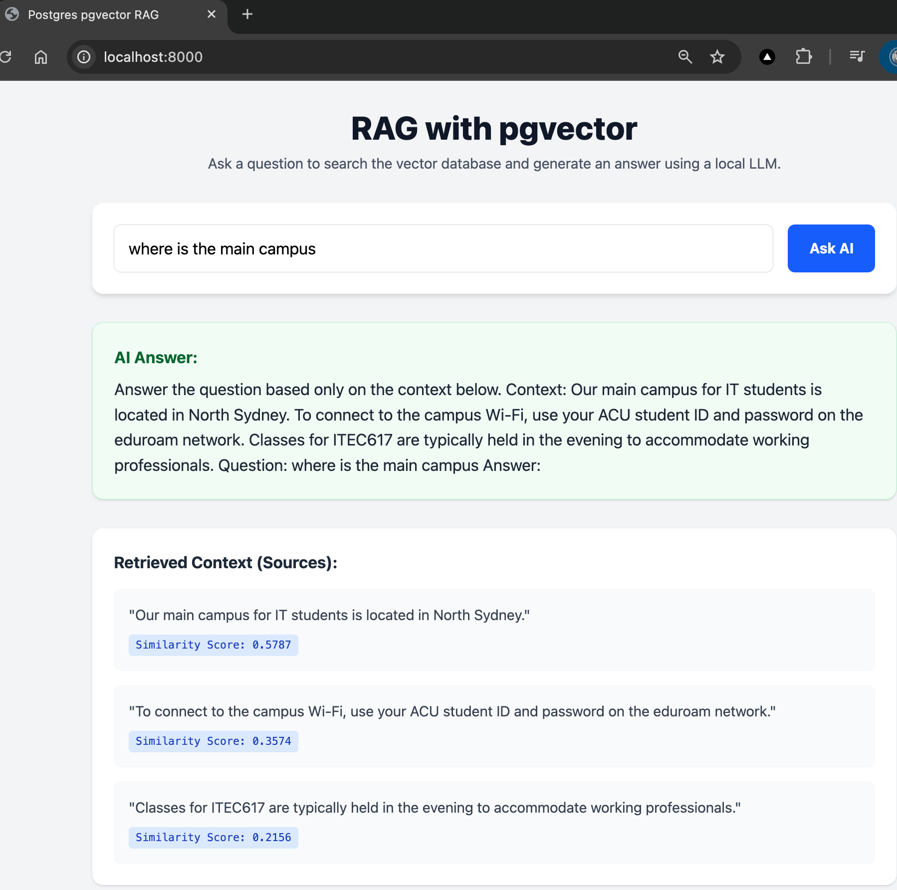

# 09.Postgres-pgvector-RAG

This project demonstrates how to build a **Retrieval-Augmented Generation (RAG)** application using **PostgreSQL** with the **pgvector** extension.
It uses a Python (FastAPI) backend to handle requests, generates vector embeddings locally using `sentence-transformers`, searches the database for similar context, and answers questions using a local LLM (`google/flan-t5-small`).

## Screenshot(s)

## Learning Objectives
- Understand the role of Vector Databases in modern AI applications.
- Learn how to store and query high-dimensional vectors directly in PostgreSQL using `pgvector`.
- See how to compute vector embeddings from text in Python.
- Understand how to structure a simple RAG pipeline: Query -> Embed -> Search -> Augment -> Generate.

## Getting Started
Please refer to the [QUICKSTART.md](QUICKSTART.md) guide for step-by-step instructions on setting up the environment.

## Screenshots
Screenshots illustrating the UI and the vector storage in pgAdmin are available in the `images` directory.
