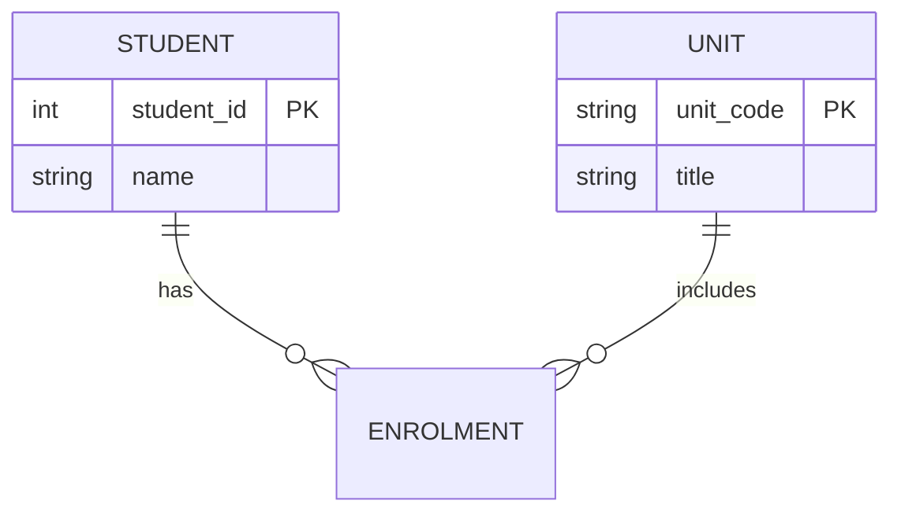

# Database Tools

A practical overview of tools commonly used for querying, diagramming, and designing databases. Pick what fits your workflow — many of these appear throughout ITEC617 labs (especially pgAdmin with PostgreSQL).

## 1. DB Clients

Desktop or web clients for connecting to databases, running SQL, browsing schemas, and inspecting data.

| Tool | Notes | Link |
|------|--------|------|
| **DataGrip** | Recommended. Full-featured JetBrains IDE for multiple database engines | [jetbrains.com/datagrip](https://www.jetbrains.com/datagrip/) |
| **TablePlus** | Clean, modern native client; good for quick day-to-day work | [tableplus.com](https://tableplus.com/) |
| **DBeaver** | Lightweight, free/open-source; solid all-rounder | [dbeaver.io](https://dbeaver.io/) |
| **pgAdmin** | Web-based admin for PostgreSQL (used in this unit’s Docker labs) | [pgadmin.org](https://www.pgadmin.org/) |
| **phpMyAdmin** | Web-based admin for MySQL/MariaDB | [phpmyadmin.net](https://www.phpmyadmin.net/) |
| **MySQL Workbench** | Official MySQL desktop client with design and admin features | [dev.mysql.com/downloads/workbench](https://dev.mysql.com/downloads/workbench/) |

**Tip:** For this unit, start with **pgAdmin** (bundled in the Week01 Docker setups). Use DataGrip or TablePlus if you prefer a desktop client.

## 2. ERD Tools

Entity–Relationship Diagram (ERD) tools help you visualise tables, keys, and relationships before or alongside implementation.

| Tool | Notes | Link |
|------|--------|------|
| **dbdiagram.io** | Recommended. Fast diagrams from a simple DSL (`Table`, `Ref`, etc.) | [dbdiagram.io](https://dbdiagram.io/) |
| **Draw.io (diagrams.net)** | Free, open-source; flexible for hand-drawn ERDs and other diagrams | [diagrams.net](https://www.diagrams.net/) |
| **Lucidchart** | Collaborative, industry-standard diagramming | [lucidchart.com](https://www.lucidchart.com/) |
| **Mermaid.js** | Text-based ERDs that live in Markdown / GitHub docs | [mermaid.js.org](https://mermaid.js.org/) |

**Example (Mermaid ERD snippet):**

## 3. Modeling Tools

Heavier design tools for schema design, forward/reverse engineering, and (in some cases) enterprise data governance.

| Tool | Notes | Link |
|------|--------|------|
| **Navicat Data Modeler** | Recommended for comprehensive relational design and forward/reverse engineering | [navicat.com](https://www.navicat.com/en/products/navicat-data-modeler) |
| **DbSchema** | Visual designer with strong schema sync; SQL and NoSQL | [dbschema.com](https://dbschema.com/) |
| **erwin Data Modeler** | Enterprise-grade modeling, architecture, and governance | [quest.com/products/erwin-data-modeler](https://www.quest.com/products/erwin-data-modeler/) |
| **SQLDBM** | Cloud collaborative modeling; works well with Snowflake, SQL Server, Postgres | [sqldbm.com](https://sqldbm.com/) |

## 4. Advanced / AI-Assisted Tools

Modern workflows often combine editors, AI assistants, and protocol-based tool access:

- **AI skills / agent skills** — Reusable instruction files (e.g. `SKILL.md`) that guide AI agents to follow project conventions when generating SQL, schemas, or docs.
- **AI-based MCP (Model Context Protocol)** — Lets AI assistants call tools and data sources (databases, docs, APIs) in a structured way during development.
- **VS Code / Cursor extensions** — SQL language support, schema explorers, formatters, and database clients inside the editor (e.g. PostgreSQL, SQLTools, Database Client).

These are optional for the unit, but useful if you already work in VS Code or Cursor and want SQL help close to your code.

## Suggested starting set for ITEC617

1. **pgAdmin** — connect to the PostgreSQL containers in the weekly labs  
2. **dbdiagram.io** or **Mermaid** — sketch ERDs for assignments and notes  
3. Optionally **DataGrip** or **TablePlus** — if you want a polished desktop SQL client  
