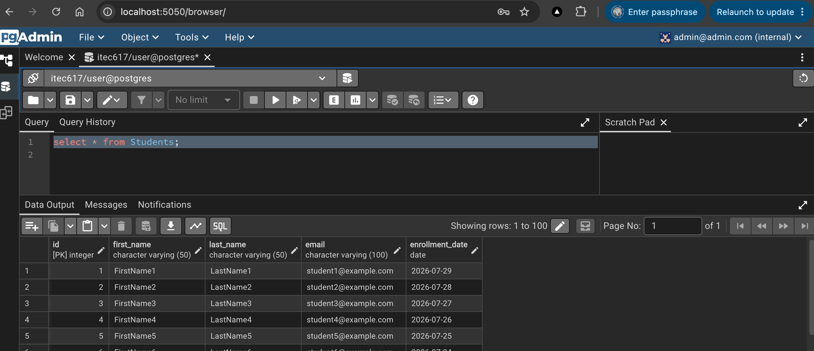

# Quickstart Guide

Follow these steps to get your PostgreSQL database and pgAdmin interface up and running.

## Screenshots



## 1. Start the Environment

Make sure you have Docker and Docker Compose installed. Open your terminal, navigate to this directory (`Week01/01.Postgres-PgAdmin`), and run:

```bash
make up
```
*(This runs `docker compose up -d` — containers start in the background.)*

This will download the necessary images and start both `postgres` and `pgadmin`. Upon the first startup, the database will automatically execute the script in the `init-scripts` folder to create and seed the `Students` table with 100 sample records.

## 2. Access pgAdmin

1. Open your web browser and navigate to [http://localhost:5050](http://localhost:5050).
2. There is **no** pgAdmin email/password login screen — you go straight to the dashboard.
3. On the left, under **Servers**, expand **ITEC617 - Week 1 DB**.
4. When prompted, enter the database password only: `password` (once per session).

You should now see the `itec617` database listed on the left panel. Navigate to **Schemas > public > Tables** to find your `Students` table. You can right-click it and select **View/Edit Data > All Rows** to see the 100 seeded records.

5. To run SQL queries, open **Tools → Query Tool**. You can write and execute SQL commands against your database here.

```sql
select * from Students;
```

## 3. Stop the Environment

When you are done, you can stop the containers by running:

```bash
make down
```
*(Note: Because we mapped a volume `postgres_data`, your database data will be preserved even after taking the containers down. If you ever want to wipe the data and start completely fresh, you can run `docker compose down -v` to remove the volumes as well.)*
