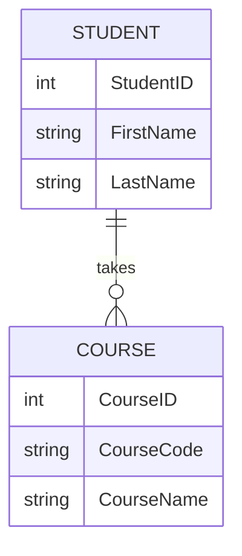
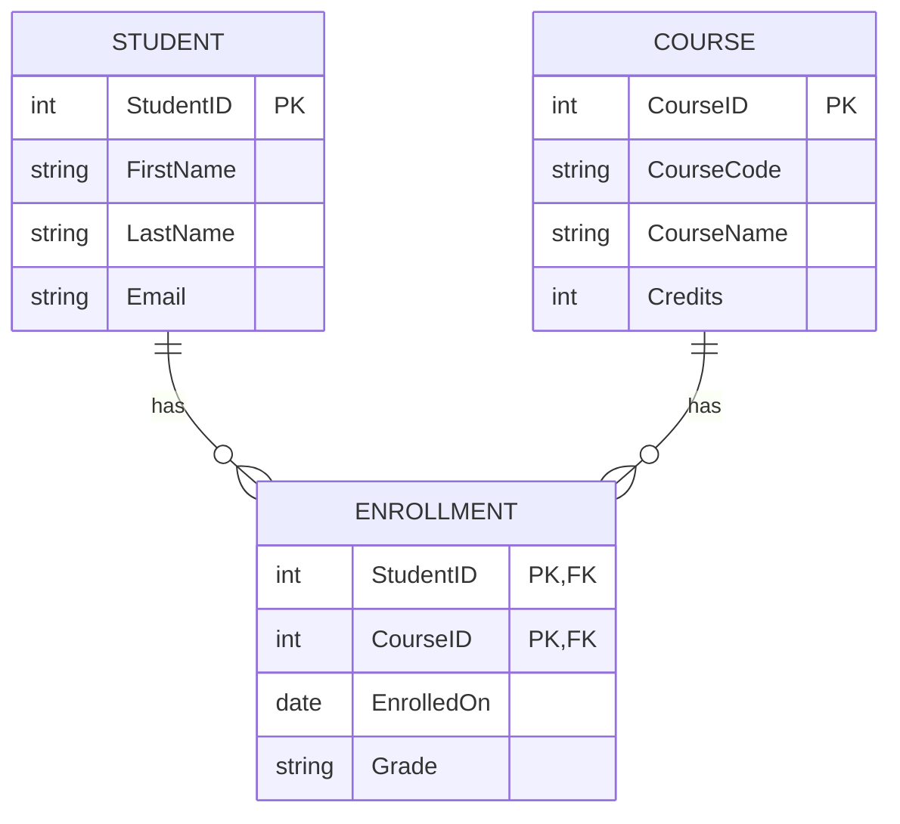

# Resolving M:N with a Bridge / Associative Entity

## The Pattern
When two entities have an M:N relationship, introduce a third entity — often called a **bridge table**, **associative entity**, or **junction table** — that sits between them.

For enrollment:

```
Student  1 ──<  Enrollment  >── 1  Course
```

- One student can have **many** enrollment rows
- One course can have **many** enrollment rows
- Together, those two 1:M links implement the original M:N business rule

## ERD Sketch (Mermaid)

**Initial M:N (conceptual):**



**Resolved design with Enrollment:**



## SQL Keys for the Bridge Table
The `Enrollment` table must include:

1. **Foreign Key** to `Students(StudentID)`
2. **Foreign Key** to `Courses(CourseID)`
3. **Composite Primary Key** on `(StudentID, CourseID)` — so the same student cannot enroll in the same course twice

Optional attributes that belong to the *relationship* (not to Student or Course alone) also go on the bridge table — e.g., `EnrolledOn`, `Grade`.
