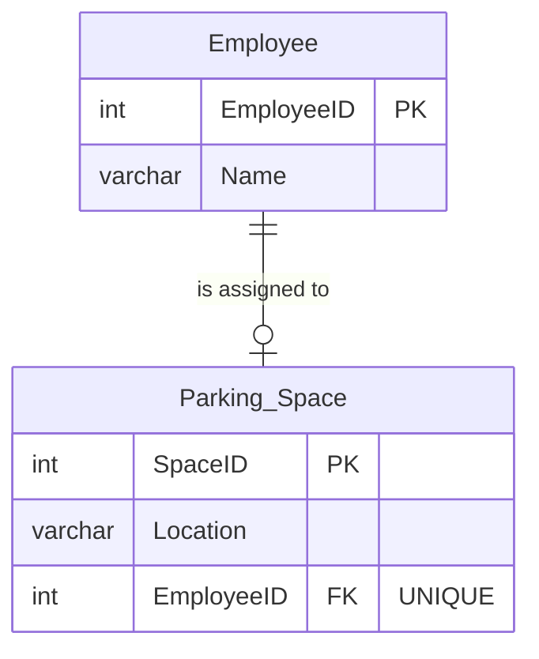
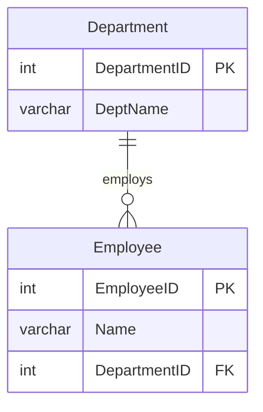
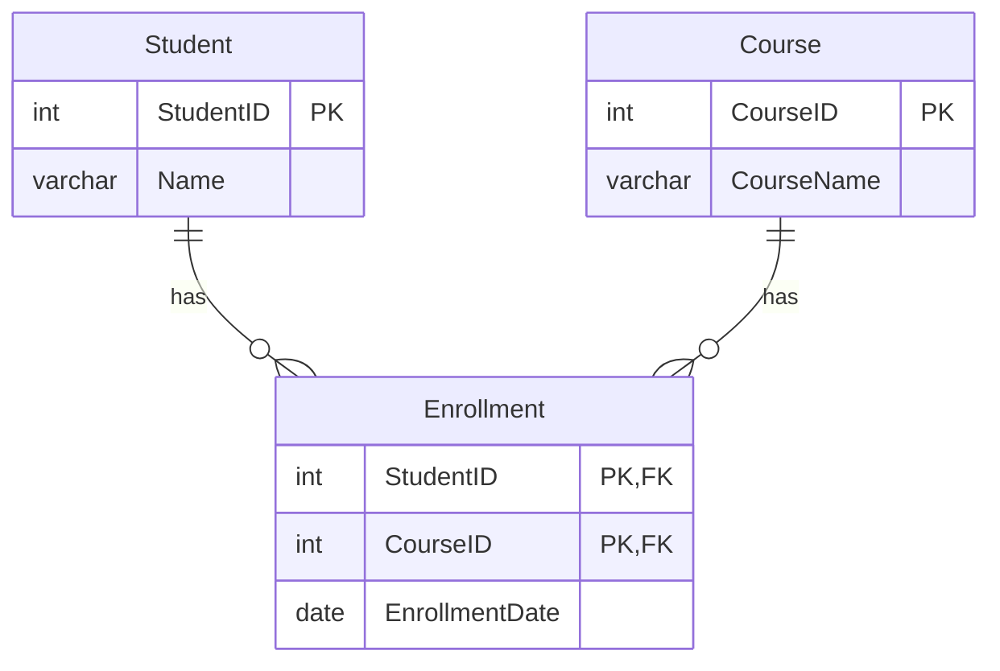

# Relationships in SQL

## Overview
In a relational database, entities rarely exist in isolation. Relationships describe the bidirectional associations between different entities (tables). Designing proper relationships is crucial for maintaining data integrity, enabling efficient queries, and accurately modeling real-world business rules.

## Quick Review of Mapping (Cardinality)
Cardinality defines the maximum number of instances of one entity that can be associated with instances of another entity.
| Relationship Type | Description |
| :--- | :--- |
| **1:1 (One-to-One / Injective)** | An occurrence of entity A relates to at most one occurrence of entity B, and vice versa. |
| **1:N (One-to-Many)** | An occurrence of entity A relates to many occurrences of entity B, but an occurrence of entity B relates to only one occurrence of entity A. |
| **N:1 (Many-to-One)** | The reverse of 1:N. Many occurrences of entity A relate to a single occurrence of entity B. |
| **N:M (Many-to-Many)** | An occurrence of entity A relates to many occurrences of entity B, and vice versa. In SQL, this mapping requires an intermediate junction (or associative) table to implement. |

## Recognizing the Relationship: Characteristics & Strength
When defining relationships, it's important to understand their strength and participation constraints:

| Characteristic | Sub-Type | Description |
| :--- | :--- | :--- |
| **Relationship Strength** | **Weak (Non-identifying) Relationship** | Occurs when the primary key of the related entity does not contain any primary key components of the parent entity. The child entity can exist independently. |
| | **Strong (Identifying) Relationship** | Occurs when the primary key of the related entity inherits a primary key component from the parent entity. |
| **Weak Entities** | | An entity that is existence-dependent on a parent entity and possesses a primary key that is partially or totally derived from that parent entity. The database designer determines whether an entity is weak based on organizational business rules. |
| **Relationship Participation** | **Optional Participation** | One entity occurrence does not require a corresponding entity occurrence in the relationship. |
| | **Mandatory Participation** | One entity occurrence strictly requires a corresponding entity occurrence in the relationship. |
| **Recursive Relationships** | | An association that exists between occurrences of the same entity set, which naturally occurs in unary relationships (e.g., an Employee manages other Employees). A common pitfall in recursive relationships is confusing participation constraints with referential integrity. |

## Examples of Each Type of Relationship (with SQL)

### 1:1 (One-to-One) Example
Let's link an `Employee` to a `Parking_Space`. One employee gets one space, and one space belongs to one employee.
```sql
CREATE TABLE Employee (
    EmployeeID INT PRIMARY KEY,
    Name VARCHAR(100)
);

CREATE TABLE Parking_Space (
    SpaceID INT PRIMARY KEY,
    Location VARCHAR(50),
    EmployeeID INT UNIQUE, -- The UNIQUE constraint is what enforces 1:1
    FOREIGN KEY (EmployeeID) REFERENCES Employee(EmployeeID)
);
```



### 1:N (One-to-Many) Example
A `Department` has many `Employees`, but an `Employee` belongs to only one `Department`.
```sql
CREATE TABLE Department (
    DepartmentID INT PRIMARY KEY,
    DeptName VARCHAR(100)
);

CREATE TABLE Employee (
    EmployeeID INT PRIMARY KEY,
    Name VARCHAR(100),
    DepartmentID INT, -- The "Many" side holds the Foreign Key
    FOREIGN KEY (DepartmentID) REFERENCES Department(DepartmentID)
);
```



### N:M (Many-to-Many) Example
A `Student` can enroll in many `Courses`, and a `Course` can have many `Students`. This requires an associative (junction) table, which often forms a Strong (Identifying) Relationship if its PK is made up of its parents' PKs.
```sql
CREATE TABLE Student (
    StudentID INT PRIMARY KEY,
    Name VARCHAR(100)
);

CREATE TABLE Course (
    CourseID INT PRIMARY KEY,
    CourseName VARCHAR(100)
);

-- Junction table with a Composite Primary Key
CREATE TABLE Enrollment (
    StudentID INT,
    CourseID INT,
    EnrollmentDate DATE,
    PRIMARY KEY (StudentID, CourseID),
    FOREIGN KEY (StudentID) REFERENCES Student(StudentID),
    FOREIGN KEY (CourseID) REFERENCES Course(CourseID)
);
```



## Tips and Signs When Deciding the Relationship
*   **Look for ownership/containment:** If entity B cannot exist without entity A (e.g., an Order Item without an Order), you likely have a strong (identifying) relationship and a weak entity.
*   **Check the "Many" side:** In a 1:N relationship, the foreign key *always* goes on the "Many" side table. For example, because a Department has many Employees, the `Employee` table gets the `DepartmentID` column.
*   **Look for plural nouns in requirements:** "An author writes **books**" implies a 1:N or N:M relationship, depending on whether a book can be co-authored.
*   **N:M requires a bridge:** If you find yourself saying "Many of A have Many of B", stop trying to put a foreign key directly in A or B. You must create a new junction table.
*   **Use UNIQUE for 1:1:** If you put a foreign key in Table B referencing Table A, it is 1:N by default. You must explicitly add a `UNIQUE` constraint on the foreign key column to limit it to a 1:1 relationship.

## Conclusion
Understanding and correctly implementing relationships (1:1, 1:N, N:M) is fundamental to robust database design. By identifying the cardinality, strength (strong vs. weak), and participation (mandatory vs. optional) of these associations, you ensure that your SQL schemas enforce business rules, maintain integrity, and avoid data anomalies.
