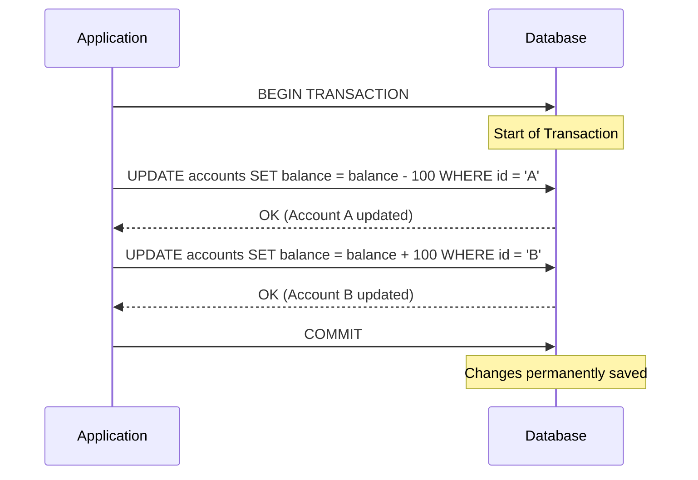
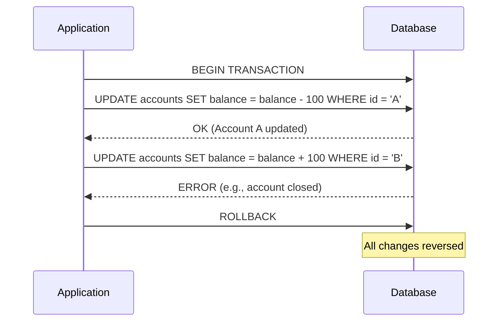

# ACID Properties in Database Transactions

ACID is a set of guiding principles that ensure database transactions are processed reliably. When dealing with **transactional workloads**—data that tracks an organization's day-to-day activities—the database must guarantee these four fundamental rules. 

In relational database management systems (RDBMS), these properties are practically enforced and managed through **Transaction Management**. This includes writing SQL commands like `COMMIT` and `ROLLBACK` to define transaction boundaries, and understanding how the transaction log keeps track of updates to recover the database in case of failures.

---

## Introduction to ACID

A **transaction** is a sequence of operations performed as a single logical unit of work. To ensure data integrity even in the event of errors, power failures, or system crashes, a database system must guarantee the **ACID** properties:

*   **Atomicity (A)**: *"All or Nothing."* A transaction is an indivisible unit. Either all its operations are executed successfully, or none are. If any part fails, the entire transaction is rolled back.
*   **Consistency (C)**: A transaction must transition the database from one valid state to another. All predefined rules, constraints (like foreign keys, check constraints, or unique constraints), and triggers must be satisfied at the end of the transaction.
*   **Isolation (I)**: Concurrent execution of transactions leaves the database in the same state as if the transactions were executed sequentially. The intermediate states of a transaction are invisible to other transactions.
*   **Durability (D)**: Once a transaction has been successfully committed, its changes are permanent and will survive any subsequent system failures.

---

## Example Scenario: Bank Transfer

Let's consider a classic bank transfer scenario: Transferring $100 from Account A to Account B. 

This requires two operations:
1.  Deduct $100 from Account A.
2.  Add $100 to Account B.

### Successful Transaction (COMMIT)

If both operations succeed, the transaction is committed, ensuring **Durability**. The **Atomicity** ensures both steps happen together, maintaining **Consistency** (the total money in the bank remains the same).



**SQL Implementation:**
```sql
-- Start the transaction
BEGIN TRANSACTION;

-- Operation 1: Deduct from Sender
UPDATE accounts 
SET balance = balance - 100 
WHERE account_id = 'A';

-- Operation 2: Add to Receiver
UPDATE accounts 
SET balance = balance + 100 
WHERE account_id = 'B';

-- If both operations succeed, save the changes permanently:
COMMIT;
```

### Failed Transaction (ROLLBACK)

If an error occurs after Operation 1 (e.g., system crash, or Operation 2 violates a constraint because Account B is invalid), we must roll back to maintain **Atomicity** and **Consistency**. Without rollback, Account A would lose $100, but Account B would never receive it.



**SQL Implementation:**
```sql
-- Start the transaction
BEGIN TRANSACTION;

-- Operation 1: Deduct from Sender
UPDATE accounts 
SET balance = balance - 100 
WHERE account_id = 'A';

-- Assume an error happens here (e.g., Account B doesn't exist)
-- To undo Operation 1, we issue a rollback:
ROLLBACK;
```
