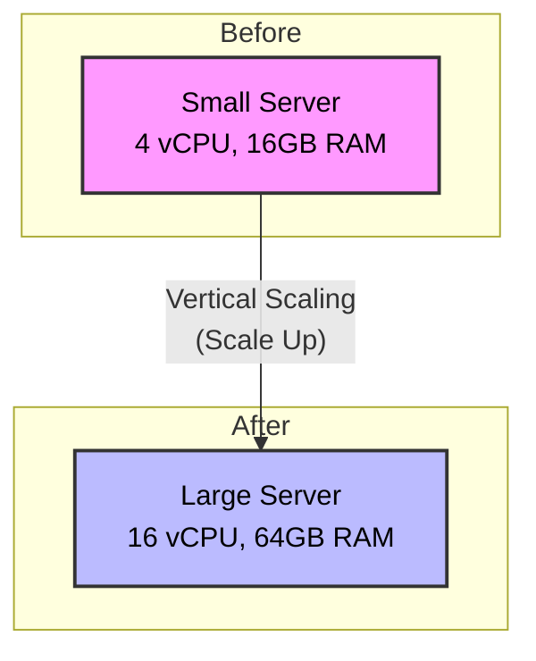
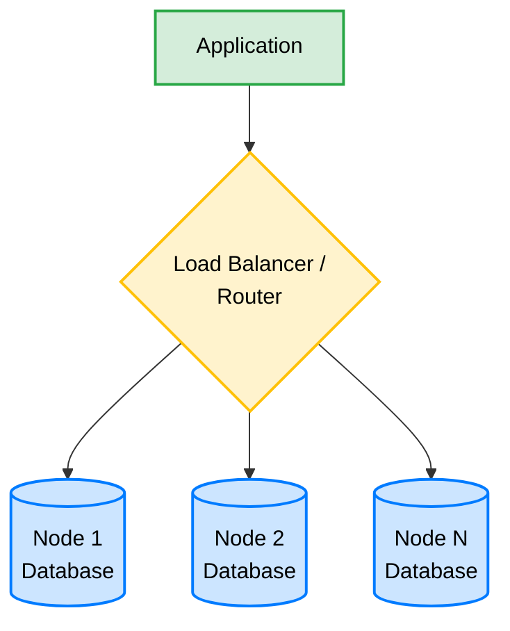

# Database Scaling

## Overview
Database scaling is the process of increasing the capacity of a database system to handle growing workloads, larger volumes of data, and higher numbers of concurrent users. As an application grows, the database often becomes the primary bottleneck. Scaling ensures that the system remains responsive, available, and performant under increased demand.

## Why Scaling?
There are several key reasons why database scaling is necessary:
- **Performance:** To maintain fast query response times and handle a high volume of transactions per second (TPS).
- **Storage Limits:** To accommodate rapidly growing datasets that exceed the physical storage limits of a single machine.
- **High Availability and Fault Tolerance:** To ensure the database remains operational even if a single server fails.
- **Concurrency:** To support an increasing number of users accessing the database simultaneously without timeouts or connection drops.

## Types of Scaling

### Vertical Scaling (Scaling Up)
Vertical scaling involves adding more computing resources—such as CPU, RAM, or storage—to an existing database server.

**Pros:**
- Simple to implement (often just a hardware upgrade or VM reconfiguration).
- Requires no changes to the application code.
- Data remains on a single node, preserving complex ACID transactions.

**Cons:**
- Hardware has an absolute physical limit; you cannot scale vertically forever.
- Can involve downtime during the upgrade process.
- Can be highly expensive, as top-tier hardware costs scale exponentially.

### Horizontal Scaling (Scaling Out)
Horizontal scaling involves adding more servers (nodes) to the database environment to distribute the data and workload across a cluster of lower-cost, commodity machines.

**Pros:**
- Virtually limitless scalability by simply adding more nodes.
- High fault tolerance; if one node fails, others can take over.
- Cost-effective, as it uses standard hardware rather than expensive super-servers.

**Cons:**
- High complexity in setup and maintenance.
- Distributed data can make maintaining ACID compliance challenging (often explained by the CAP Theorem).
- May require application-level changes (e.g., routing queries).

## When Do We Need Scaling?
Scaling shouldn't be done prematurely. Here are the key signals indicating it's time to scale:
- **Resource Exhaustion:** Sustained high CPU, RAM, or disk I/O utilization (e.g., consistently over 80%).
- **Slow Query Performance:** Gradual increase in query execution times, leading to a sluggish application.
- **Storage Capacity Alerts:** The database disk is approaching maximum capacity.
- **Connection Limits:** Frequent "too many connections" errors or application timeouts when connecting to the database.
- **Replication Lag:** In an existing distributed setup, if secondary nodes are struggling to keep up with the primary node's updates.

## How to Implement Scaling (Conceptual)
Implementing scaling, particularly horizontal scaling, involves several techniques:

1. **Read Replicas:** 
   - A single **Primary (Master)** node handles all Write operations.
   - Multiple **Secondary (Slave)** nodes replicate data from the primary and handle Read operations. 
   - Great for read-heavy applications.
2. **Sharding (Partitioning):**
   - Data is split into smaller, independent chunks called shards. 
   - Each shard is hosted on a separate server. For example, users A-M on Server 1, N-Z on Server 2.
3. **Clustering:**
   - Multiple database servers work together to represent a single unified database. 
   - Provides both load balancing and high availability.
4. **Caching:**
   - Introducing an in-memory cache (like Redis or Memcached) in front of the database to absorb frequent read requests, reducing the load on the database itself.

## Scaling in Practice

### Scaling On-Premises PostgreSQL
When managing a PostgreSQL database on your own hardware or VMs:
- **Vertical:** You must physically add RAM/Storage to the server or allocate more resources to the VM, typically requiring brief downtime to restart the server.
- **Horizontal:** 
  - **Read Replicas:** Configure PostgreSQL *Streaming Replication* to create secondary nodes for read-only queries.
  - **Connection Pooling:** Use tools like *PgBouncer* to handle thousands of concurrent connections efficiently without overloading the DB processes.
  - **Sharding:** Use extensions like *Citus* to transform standard PostgreSQL into a distributed database, allowing you to shard data horizontally across multiple nodes.

### Scaling AWS Databases (Amazon RDS & DynamoDB)
Cloud providers make scaling significantly easier.

- **Amazon RDS (Relational Database Service - e.g., PostgreSQL/MySQL):**
  - **Vertical:** Achieved with a few clicks in the console by modifying the "DB Instance Class" (e.g., from a `db.t3.medium` to a `db.m5.large`). AWS handles the underlying server swap with minimal downtime.
  - **Horizontal:** You can easily provision "Read Replicas" via the AWS console to offload read traffic.
- **Amazon DynamoDB (NoSQL):**
  - DynamoDB is designed for massive **horizontal scaling** by default. 
  - It uses automatic partitioning under the hood to distribute data across many servers as your table size grows.
  - You scale it by simply adjusting the Provisioned Read/Write Capacity Units (RCU/WCU) or setting it to "On-Demand" mode, where AWS automatically scales resources up and down based on real-time traffic without any server management.

## Conclusions
Understanding how and when to scale is critical for building resilient applications. **Vertical scaling** is the simplest approach and maintains complex transactional integrity, but it has physical and financial limits. **Horizontal scaling** offers massive scalability and high availability but introduces architectural complexity. Modern cloud environments (like AWS) and advanced database tools have drastically simplified both methods, allowing systems to grow seamlessly alongside user demand.
