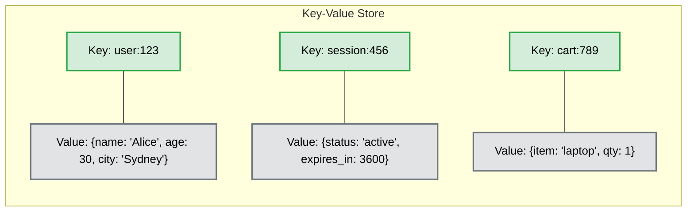
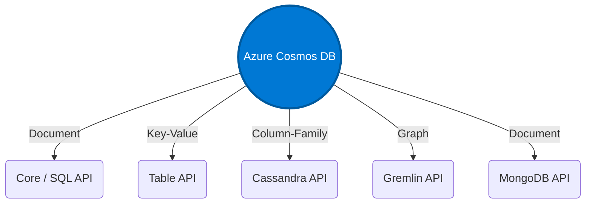

# Introduction to NoSQL

## Overview
NoSQL (originally referring to "non SQL" or "non-relational") databases are a class of database management systems that do not rely on the traditional relational database model (RDBMS). Unlike relational databases that use rigid tables, rows, and columns, NoSQL databases use flexible data models designed for specific types of data storage and access patterns. They are primarily built to handle large volumes of unstructured or semi-structured data, offer high performance, and scale out horizontally with ease.

## Key-Value Storage
Key-value stores are one of the simplest and fastest types of NoSQL databases. In this model, every item in the database is stored as an attribute name (or "key"), together with its value.

**Characteristics of Key-Value Stores:**
- **High Performance:** Retrieving a value by its exact key is incredibly fast (O(1) time complexity).
- **Schema-less:** Values can be strings, numbers, or complex JSON objects. Different rows do not need to share the same properties.
- **Use cases:** Caching (e.g., Redis), session management, user preferences, and shopping carts.

## Why NoSQL?
The rise of NoSQL databases was driven by the limitations of traditional relational databases when dealing with modern web-scale applications:
- **Big Data Volume and Velocity:** Applications generating massive amounts of data at high speed (like IoT sensors or social media feeds) overwhelm traditional vertical scaling limits.
- **Flexible Data Structures:** Modern development often deals with varied or evolving data structures (semi-structured/unstructured data) where rigid schemas create friction.
- **Distributed Systems:** NoSQL is built from the ground up for distributed architectures, allowing databases to be spread across multiple servers or geographical regions seamlessly.

## When Do We Need NoSQL Instead of Relational SQL?

### Use Cases for NoSQL
Choose NoSQL when:
- You need to store massive amounts of data (terabytes or petabytes).
- You require rapid horizontal scaling (scaling out across commodity servers).
- The data structure is unknown, changes frequently, or doesn't fit neatly into tables.
- You need extremely fast reads/writes for specific simple queries.
- Examples: 
  - **Social Media:** Storing user feeds and connections (Document or Graph databases).
  - **E-commerce:** High-speed product catalogs with varying attributes (Document databases).
  - **Real-time Analytics:** Logging and high-speed data ingestion (Column-family databases).

### Use Cases for Relational SQL
Choose SQL when:
- Data integrity and strict adherence to ACID properties (Atomicity, Consistency, Isolation, Durability) are paramount.
- The data structure is highly structured, predictable, and rarely changes.
- Your application relies heavily on complex, multi-table JOIN operations.
- Examples: 
  - **Financial Systems:** Banking transactions and accounting where data consistency is critical.
  - **Enterprise Resource Planning (ERP):** Complex business processes with highly interrelated data.
  - **Inventory Management:** Systems requiring strict transactional control over stock levels.

## Compare NoSQL vs SQL: Weaknesses and Strengths

| Feature | SQL (Relational) | NoSQL (Non-Relational) |
| :--- | :--- | :--- |
| **Data Model** | Tables with fixed rows and columns. | Key-value, Document, Graph, or Column-family. Flexible schema. |
| **Scaling** | Primarily Vertical (Scale Up). | Primarily Horizontal (Scale Out). |
| **Queries** | Powerful query language (SQL) for complex JOINs. | Queries are focused on data retrieval; JOINs are usually discouraged or unsupported. |
| **Integrity** | Strong ACID guarantees. | Often sacrifices some consistency for availability and partition tolerance (CAP Theorem), leaning towards BASE (Basically Available, Soft state, Eventual consistency). |
| **Strengths** | Data consistency, standardized querying, mature ecosystem. | Scalability, flexibility, high performance for specific access patterns. |
| **Weaknesses** | Rigid schema changes, scaling bottlenecks at large volumes. | Lack of standardization, weaker complex query capabilities, eventual consistency models. |

## Examples of Implementations

### MongoDB (Document Database)
MongoDB is one of the most popular NoSQL databases. It stores data in flexible, JSON-like documents. This means fields can vary from document to document and data structure can be changed over time. It is highly favored by developers for its ease of use and seamless integration with JavaScript-based stacks (e.g., MERN stack).

### Azure Cosmos DB (Multi-Model Database)
Microsoft's Azure Cosmos DB is a globally distributed, multi-model database service. It is designed for single-digit millisecond response times and high availability. 
- It is "multi-model" because it provides multiple APIs to interact with the data, including a **Core (SQL) API** for document data, a **Table API** for Key-Value storage, a **Cassandra API** for column-family data, and a **Gremlin API** for graph data.

### Redis (Key-Value Store)
An open-source, in-memory data structure store, used as a database, cache, and message broker. Known for lightning-fast performance.

### Apache Cassandra (Wide-Column Store)
Originally developed at Facebook, it's designed to handle massive amounts of data across many commodity servers, providing high availability with no single point of failure.

## Conclusions
NoSQL databases offer powerful alternatives to traditional relational databases, providing the necessary flexibility and scalability for modern, data-intensive applications. By understanding the distinct data models—such as Key-Value stores—and their respective trade-offs, developers and architects can select the right tool for the job. While SQL remains the gold standard for complex transactions and structured data, NoSQL dominates in scenarios demanding rapid scale, varied data structures, and high-velocity processing.
